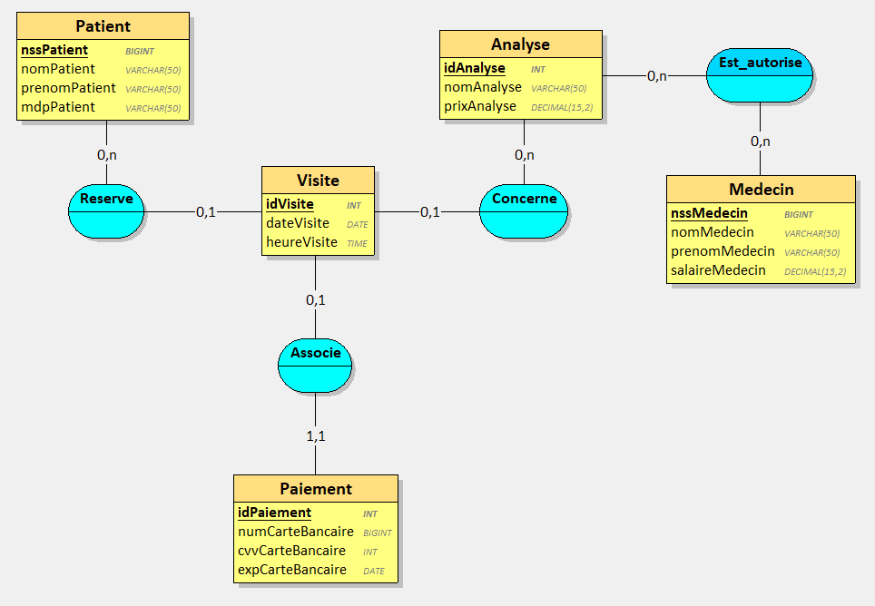
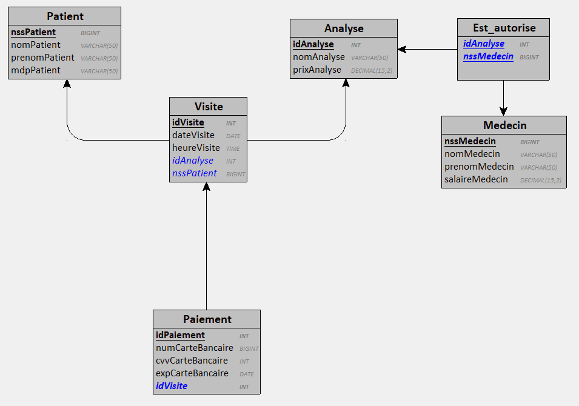
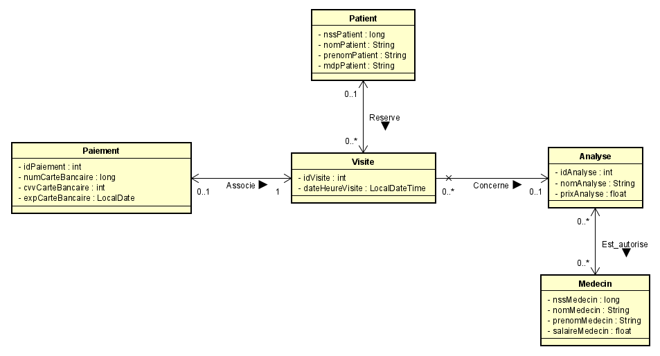

# LaboratoireDAnalyses_JDBC

## Table des matières

- [LaboratoireDAnalyses\_JDBC](#laboratoiredanalyses_jdbc)
  - [Table des matières](#table-des-matières)
  - [Présentation](#présentation)
    - [Contenu](#contenu)
  - [Conception](#conception)
    - [Modèle conceptuel de données](#modèle-conceptuel-de-données)
    - [Modèle logique de données](#modèle-logique-de-données)
    - [Diagramme de classes](#diagramme-de-classes)
  - [Manuel de l'utilisateur](#manuel-de-lutilisateur)
    - [Outils nécessaires](#outils-nécessaires)
    - [Installation](#installation)
    - [Utilisation](#utilisation)

## Présentation

Projet de programmation d'une application liée à une base de données permettant de gérer la réservation et le paiement de visites dans un laboratoire d'analyses. Projet réalisé dans le cadre du module "Lien SGBD - Langage OO" du septième semestre du cycle ingénieur de Polytech Tours.

Cette application a été développée en Java en faisant appel à JDBC pour se connecter à une base de données MySQL.

### Contenu

Cette application permet à des patients de réserver et de payer des visites pour faire des analyses dans un laboratoire d'analyses médicales. Un patient souhaitant réserver une visite va pouvoir se connecter puis sélectionner une analyse à effectuer et l'application lui proposera le premier créneau de visite disponible qu'il pourra réserver puis payer.

## Conception

### Modèle conceptuel de données

### Modèle logique de données

### Diagramme de classes

## Manuel de l'utilisateur

### Outils nécessaires

- Eclipse IDE
- MySQL Community Server 8.1, installé en version complète et configuré avec MySQL Configurator en indiquant "root" en mot de passe root
- MySQL Workbench 8

### Installation

1. Ouvrir MySQL Workbench et créer une nouvelle connexion (nommée "tp" par exemple)
2. Aller dans la connexion créée et ajouter une nouvelle base de données nommée "laboratoiredanalyses"
3. Ouvrir le projet dans eclipse et lancer Main.java
4. La base de données est automatiquement remplie au lancement du programme et la fenêtre du programme s'ouvre. (Il est possible de consulter le contenu de la base de données dans MySQL Workbench)

### Utilisation

1. Saisir le numéro de sécurité sociale du patient voulant réserver et payer une visite (le patient doit être déjà enregistré dans la base)
2. Saisir le mot de passe du patient
3. La liste des analyses proposées par le laboratoire s'affiche. Saisir le numéro correspondant à l'analyse à effectuer
4. La date et l'heure de la première visite disponible pour cette analyse s'affiche
5. Accepter ou non la proposition de visite
6. Si la proposition est acceptée, la visite est réservée
7. Saisir le numéro de la carte bancaire à utiliser pour payer la visite
8. Saisir le cryptogramme visuel de la carte bancaire
9. Saisir le mois d'expiration de la carte bancaire
10. Saisir l'année d'expiration de la carte bancaire
11. Si toutes les informations sont valides, le paiement de la visite est validé
