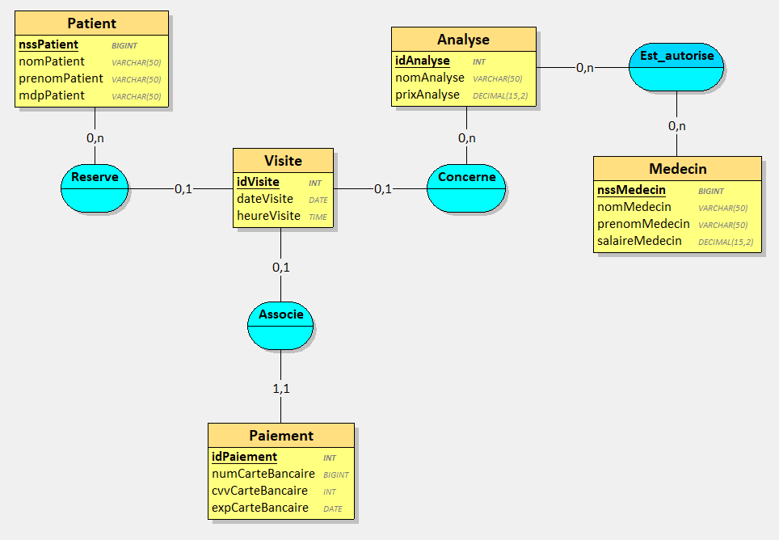

# LaboratoireDAnalyses

## Table des matières

- [LaboratoireDAnalyses](#laboratoiredanalyses)
  - [Table des matières](#table-des-matières)
  - [Présentation](#présentation)
    - [Contenu](#contenu)
  - [Conception](#conception)
    - [Modèle conceptuel de données](#modèle-conceptuel-de-données)
    - [Modèle logique de données](#modèle-logique-de-données)
    - [Diagramme de classes](#diagramme-de-classes)
  - [Manuel de l'utilisateur](#manuel-de-lutilisateur)
    - [Outils nécessaires](#outils-nécessaires)
    - [Installation](#installation)
  - [Documentation](#documentation)

## Présentation

Projet de programmation d'une application liée à une base de données permettant de gérer la réservation et le paiement de visites dans un laboratoire d'analyses. Projet réalisé dans le cadre du module "Lien SGBD - Langage OO" du septième semestre du cycle ingénieur de Polytech Tours.

### Contenu

Cette application permet à des patients de réserver et de payer des visites pour faire des analyses dans un laboratoire d'analyses médicales. Un patient souhaitant réserver une visite va pouvoir se connecter puis sélectionner une analyse à effectuer et l'application lui proposera le premier créneau de visite disponible qu'il pourra réserver puis payer.

Cette application a été développée en Java en lien avec une base de données MySQL en deux versions distinctes :

- [LaboratoireDAnalyses_JDBC](./LaboratoireDAnalyses_JDBC/) : Une version faisant appel à JDBC et comportant une interface console
- [LaboratoireDAnalyses_Hibernate](./LaboratoireDAnalyses_Hibernate/) : Une version faisant appel à Hibernate et comportant une interface graphique JavaFX

## Conception

### Modèle conceptuel de données

### Modèle logique de données

### Diagramme de classes

## Manuel de l'utilisateur

### Outils nécessaires

- Eclipse IDE
- MySQL Community Server 8.1, installé en version complète et configuré avec MySQL Configurator en indiquant "root" en mot de passe root
- MySQL Workbench 8

### Installation

1. Ouvrir MySQL Workbench et créer une nouvelle connexion (nommée "tp" par exemple)
2. Aller dans la connexion créée et ajouter une nouvelle base de données nommée "laboratoiredanalyses"
3. Ouvrir le projet dans eclipse et lancer Main.java
4. La base de données est automatiquement remplie au lancement du programme et la fenêtre du programme s'ouvre. (Il est possible de consulter le contenu de la base de données dans MySQL Workbench)

## Documentation

La documentation spécifique à chaque version est disponible dans les fichiers README de chaque version :

- Pour la version JDBC : [Documentation](./LaboratoireDAnalyses_JDBC/README.md)
- Pour la version Hibernate : [Documentation](./LaboratoireDAnalyses_Hibernate/README.md)
